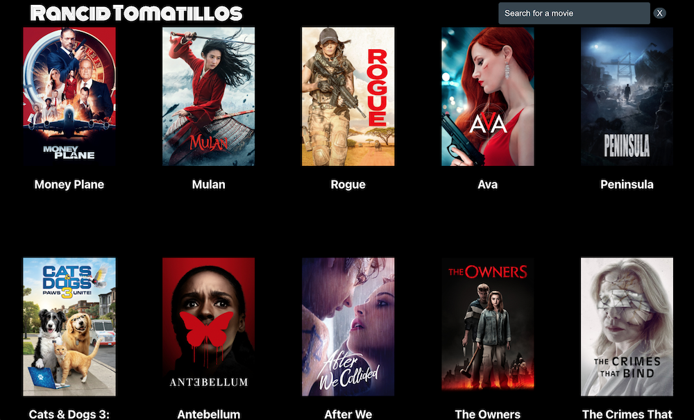

# Rancid Tomatillos


## About The Project
Rancid Tomatillos is inspired by Rotten Tomatoes, Netflix and Funimation.
This was a paired project for the 3rd module of Turing School of Software and Design's Front End Engineering program, focused on learning React.

With this application users are able to view Movie previews fetched from a RESTful API. To learn more about a movie, the use can click on the poster preview and get additional information. Users can also search by title.

#### Technologies
* React
  * React Router
* Cypress
* Javascript
* HTML
* Css

### Set Up Instructions
1. Clone this repo to your local machine
2. `cd ` into `rancid-tomatillos`
3. Then, run `npm install `from your command line. Do not run `npm audit fix --force`
4. After you run npm install inside of your copy of this repo, run:
`npm start`
This command runs the app in the development mode locally so that you can view and use the application in your browser.
```
You can now view rancid-tomatillos in the browser.
  Local:  http://localhost:3000
```

5. When you are done exploring _**Rancid Tomatillos**_ make sure that you type `Control + C` in your terminal to stop the server before closing your Terminal.

### Using the Application
Upon load, a user will see clickable movie poster previews and a search bar. To view more about a movie, the user can slimply click on the poster or title of the movie they would like to look at. They can return home by slicking the Logo at the top, using the brower back button, or removing the `/movies/(id number)` from the URL.


To search for a specific title, they can type into the live search and get movies that match what they are typing. If no movies match the search, they will be shown an error message and can either clear the search or edit it to get new results.


## Contributors

- [Matt Ruder](https://github.com/mattruder)
- [Angele Williams](https://github.com/angelewilliams)


## Acknowledgments

* [Turing Scool of Software & Design](https://turing.edu/)
* Mentors: Joshua Sevy and Kelsie Besinger Yeh
* Turing Instructors: Kayla Gordon and Robbie Jaeger


#### Planning Resources

* [Fig-Jam Organization Board](https://www.figma.com/file/KBZrIy0rlj2kwOGgSk3kNZ/rancid-tomatillos?node-id=0%3A1)
* [Project Spec](https://frontend.turing.edu/projects/module-3/rancid-tomatillos-v3.html)
